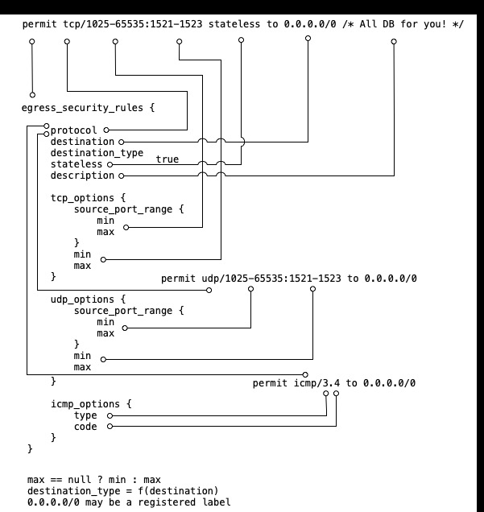
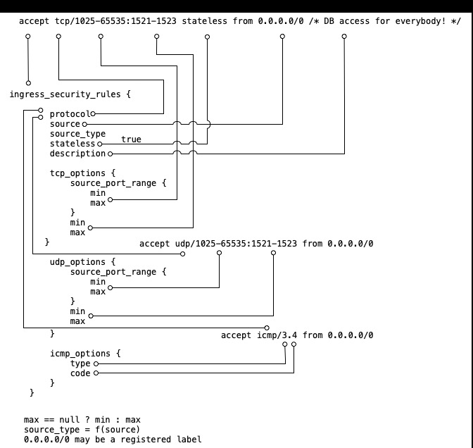

# SL_v1
OCI terraform provider requires to use quite strange way of configuring security lists. Data structure is not intuitive, and requires a lot of writing to define access list. Landing Zone libraries try to eliminate this hassle, still keeping a lot of API overhead. One of examples are min, and max fields for tcp/udp port definition. Not bad for some of use cases, but not nice for majority of them.

This library proposes two formats:
1. One line per ingress access rule

```
    accept tcp/1521-1523 from 0.0.0.0/0 stateless /* Database access for everybody! */
```

2. Optimized protocol and port numbers

```
    description = "DB access for everybody! "
    protocol    = "tcp/1521-1523"
    source      = "0.0.0.0/0"
    destination = null
    stateless   = true
```

, and the same for egress:
1. One line per access rule

```
    permit tcp/1521-1523 to 0.0.0.0/0 stateless /* All databases for you! */
```

2. Optimized protocol and port numbers

```
    description = "All databases for you!"
    protocol    = "tcp/1521-1523"
    source      = null
    destination = "0.0.0.0/0"
    stateless   = true
```

Both formats mean the same thing. In fact one-liner is always converted to the field based format, which is converted to target data structure.

Note that only difference between egress and ingress is place of CIDR at destination or source, and pair of words permit to/accept from. 

## CIDR labels


## Mapping
Following models show mapping between egress and ingress access statements and OCI terraform provider data format.

Egress access statement mapping

Ingress access statement mapping


## Terraform provider interface
TODO

## CIS LZ interface
The library produces data structure compatible with CIS Landing Zone Network Module with access code:

1. ingress

```
    local.sl_ingress["SL_NAME"].rules
```

2. egress

```
    local.sl_egress["SL_NAME"].rules
```

## Unit test
*Note: Unit test is just a draft now, but the working one.*

Unit testing is implemented using:
* expected value is provided by tf's variable
* result is taken from tf's output

Variable is set by env's TF_VAR, and output is extracted from tf plan file.

Uni test works in two modes:
1. verify list of simple outputs a=1, b=2, etc.
2. verify single complex structure

For details look into test.sh, and try it.

```
    terraform init
    . test.sh
```

with expected answer:

```
    sl_simple OK
    sl OK
    sl_egress OK
    sl_ingress OK
```

# Change list

## 5. Change lex scheme to allow tcp to, permit tcp from...
Natural language syntax is accepted now.

```
permit tcp/21-22:1521-1523 to on_premises stateless /* DB for some of you */",
accept udp/20000-30000:80-90 from internet stateless /* HTTP over UDP for some of you */
```

## 6. Extend test.sh with lex use case

## 4. Update comment's regex for ','

## 3. CIDR may be rendered from label

Access list may use labels in place of CIDRs. Labels are converted to proper value using var.cidrs map. 

```
#
# known networks map. Register here CIDR labels
#
variable cidrs {
    type = map(string)
    default = {
        "internet" = "0.0.0.0/0",
        "on_premises" = "192.0.0.0/8",
        "all_services" = "all_services"
    }
}
```

If needed network map may be provided by a local variable, what overwrites variable.

```
locals  {
    cidrs = {
        "internet" = "0.0.0.0/0",
        "on_premises" = "10.0.0.0/8",
        "all_services" = "all_services"
    }
}   
```

## 1. Implement error handling

Processing errors are reported in sl_error output. source_string contains original protocol data. Error is everything what is not:
- full pattern i.e. "(?i)(tcp|udp)\\/([0-9]*)-?([0-9]*):([0-9]*)-?([0-9]*)$"
- destination pattern i.e. "(?i)(tcp|udp)\\/([0-9]*)-?([0-9]*)$"
- icmp pattern i.e. "(?i)(icmp)\\/([0-9]+).?([0-9]*)$"

It's assumed that for each known pattern data extraction is possible, thus no other errors are reported.

```
sl_error       = {
      + demo1 = {
          + rules = [
              + {
                  + _position        = 0
                  + description      = null
                  + destination      = null
                  + destination_type = null
                  + dst_port_max     = null
                  + dst_port_min     = 0
                  + icmp_code        = null
                  + icmp_type        = null
                  + protocol         = "ERROR"
                  + source           = null
                  + source_string    = "tcp/22XX"
                  + source_type      = null
                  + src_port_max     = null
                  + src_port_min     = 0
                  + stateless        = null
                  + type             = "sl_error"
                },
            ]
        }
      + demo2 = {
          + rules = []
        }
    }
```